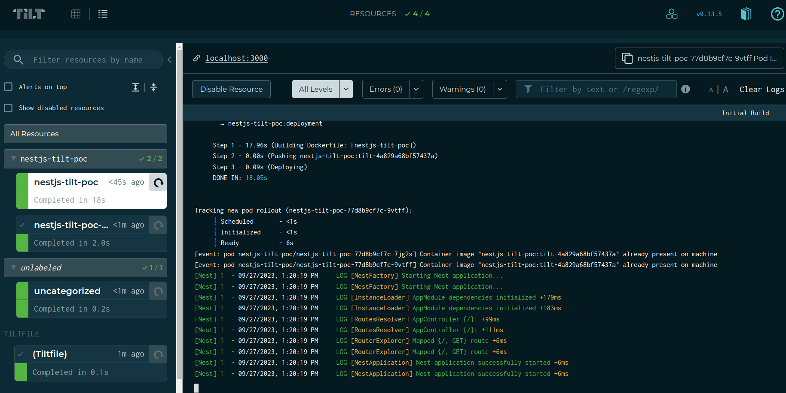
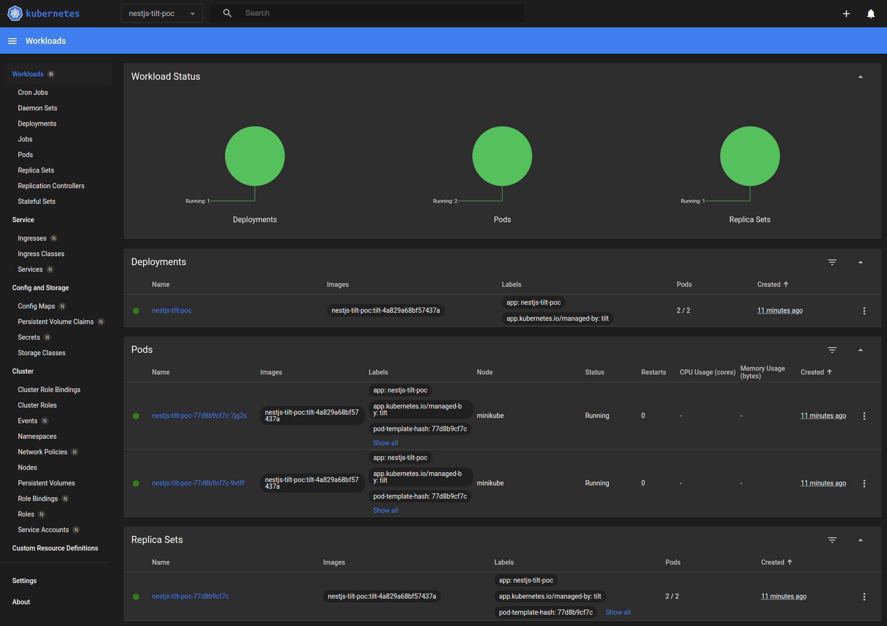

# NestJS and Tilt POC

This project is designed for testing NestJS and Tilt within a Kubernetes environment.

## Table of Contents

1. [Introduction](#introduction)
2. [Getting Started](#getting-started)
   - [Prerequisites](#prerequisites)
   - [Installation](#installation)
3. [Running the Application](#running-the-application)
4. [Running the Application Without Tilt](#running-the-application-without-titl)

## 1. Introduction <a name="introduction"></a>

This repository focuses on testing NestJS and Tilt within a Kubernetes environment. Tilt is a tool that assists
developers in working with microservices. It automates the steps from code change to new process, such as building images and
updating the environment.

## 2. Getting Started <a name="getting-started"></a>

### Prerequisites <a name="prerequisites"></a>

Before you begin, ensure that you have the following tools and dependencies installed:
- [Docker](https://docs.docker.com/engine/install/) - Containerization platform for packaging and deploying applications.
- [Minikube](https://minikube.sigs.k8s.io/docs/start) - Local, single-node Kubernetes cluster for development and testing.
- [Tilt](https://docs.tilt.dev/) - Developer tool automating Kubernetes tasks for smoother development.

### Installation <a name="installation"></a>
1. Clone this repository to your local machine:

   ```bash
   git clone https://github.com/pedrodalvy/nestjs-tilt-poc.git
   ```

2. Change to the repository directory:

   ```bash
   cd nestjs-tilt-poc
   ```

## 3. Running the Application <a name="running-the-application"></a>

To run the application, you must first build the image for the in-cluster container runtime. Use the following command
when running the project for the first time:

```sh
minikube image build -t nestjs-tilt-poc .
```

Start the application with Tilt using the following command:

```sh
tilt up
```

The `tilt up` command should yield a response like this:
```sh
❯ tilt up
Tilt started on http://localhost:10350/
v0.33.5, built 2023-09-01

(space) to open the browser
(s) to stream logs (--stream=true)
(t) to open legacy terminal mode (--legacy=true)
(ctrl-c) to exit
```

Open the link `http://localhost:10350/` to check if the app has built correctly:


## 4. Running the Application Without Tilt <a name="running-the-application-without-titl"></a>

Run the following commands to start the app with Minikube without using Tilt:

```sh
minikube image build -t nestjs-tilt-poc .
minikube kubectl -- apply -f kubernetes.yaml
minikube kubectl -- -n nestjs-tilt-poc port-forward service/nestjs-tilt-poc 3000:8000 
```

You can check if the images are built using the following command:

```sh
minikube kubectl -- get po -n nestjs-tilt-poc
```

You can also use the Minikube dashboard to check and access the pods:

```sh
minikube dashboard
```

A response like this should be returned:
```sh
❯ minikube dashboard                            
🔌  Enabling dashboard ...
    ▪ Using image docker.io/kubernetesui/dashboard:v2.7.0
    ▪ Using image docker.io/kubernetesui/metrics-scraper:v1.0.8
💡  Some dashboard features require the metrics-server addon. To enable all features please run:

        minikube addons enable metrics-server   


🤔  Verifying dashboard health ...
🚀  Launching proxy ...
🤔  Verifying proxy health ...
🎉  Opening http://127.0.0.1:46067/api/v1/namespaces/kubernetes-dashboard/services/http:kubernetes-dashboard:/proxy/ in your default browser...
```

After opening the dashboard link, select the `nestjs-tilt-poc` namespace to see the following page:

